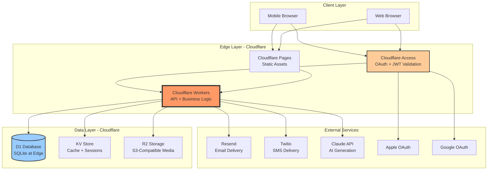
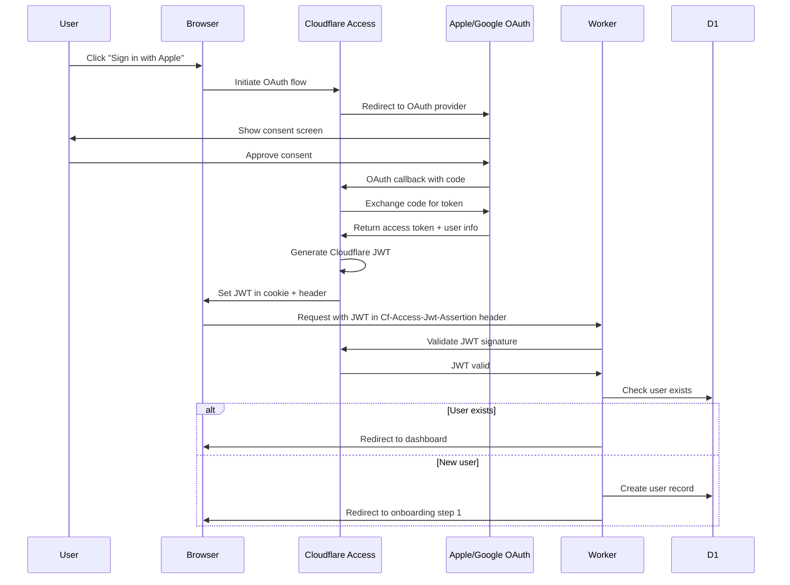
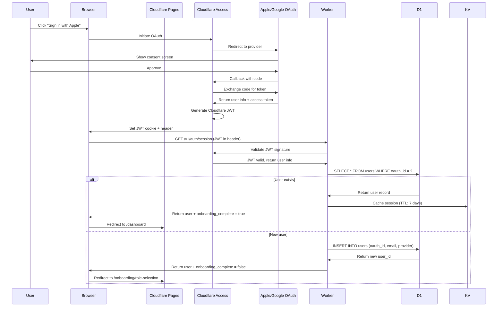
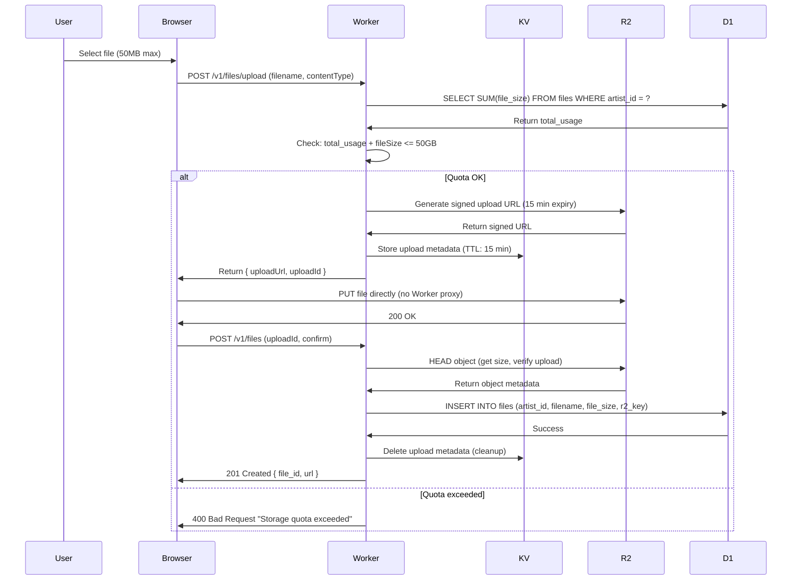
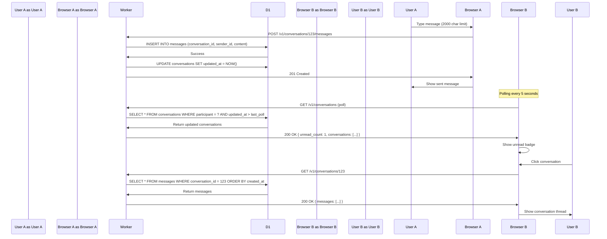
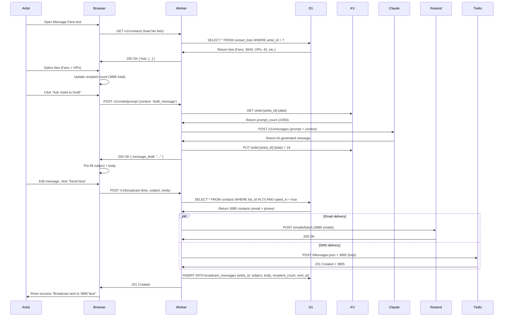
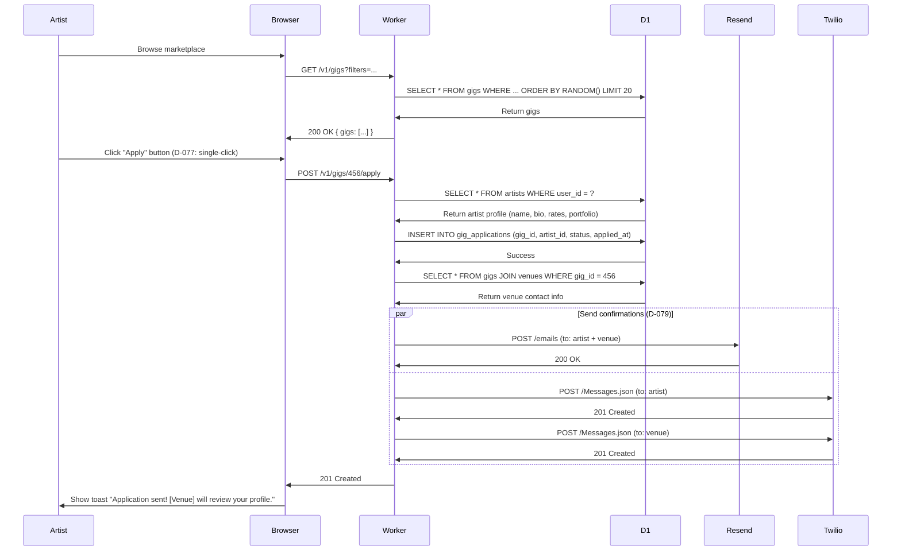
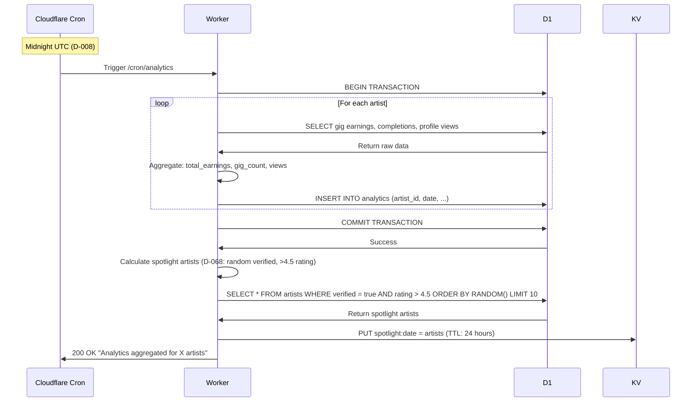
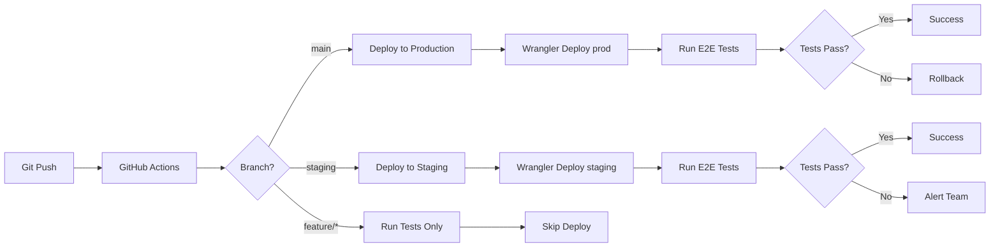

# architecture

# Umbrella MVP - System Architecture

**Version:** 1.0

**Last Updated:** October 14, 2025

**Team:** 3 Developers (Dev A: FE/UI, Dev B: FS/Marketplace, Dev C: Backend/API)

**Timeline:** 6-week MVP build

---

## Overview

Umbrella is a music industry platform connecting artists with gigs and collaboration opportunities. The MVP focuses exclusively on the artist experience, with a Cloudflare-first architecture leveraging edge computing for global performance.

### Architecture Principles

1. **Edge-First Computing**: Entire application runs on Cloudflare Workers at the edge
2. **Serverless by Default**: No traditional servers; fully serverless architecture
3. **Data at the Edge**: D1 database co-located with compute for minimal latency
4. **Selective External Services**: Only use external services for capabilities Cloudflare doesn’t provide
5. **OAuth-Only Authentication**: Apple/Google OAuth via Cloudflare Access (no email/password)
6. **Stateless Workers**: All Workers are stateless; state managed via D1/KV/R2
7. **Simple Over Complex**: Daily batch updates over real-time; polling over WebSocket

### Key Technology Decisions

| Category | Technology | Rationale |
| --- | --- | --- |
| **Compute** | Cloudflare Workers | Edge runtime, global distribution, auto-scaling |
| **Frontend** | Vite SPA (React + TypeScript) | Cloudflare-native, simpler than Next.js |
| **Database** | D1 (SQLite at edge) | Lightweight relational, edge co-location |
| **Cache** | KV | Session tokens, search results, rate limits |
| **Storage** | R2 | S3-compatible, zero egress fees, 50GB/artist quota |
| **Auth** | Cloudflare Access | Built-in OAuth, JWT validation |
| **Email** | Resend | Production-ready, better than Cloudflare Email (beta) |
| **SMS** | Twilio | Cloudflare has no SMS capability |
| **AI** | Claude API (Anthropic) | Violet AI toolkit, 50 prompts/day |

### Architecture Constraints

These constraints are **intentional design decisions**, not limitations:

- ✅ **OAuth-only auth** (D-001): Apple/Google only via Cloudflare Access
- ✅ **Polling-based messaging** (no WebSocket): Acceptable for MVP scale
- ✅ **Daily batch metrics** (D-008): Updates at midnight UTC, not real-time
- ✅ **No AI matching** (D-014): Random shuffle + manual filters only
- ✅ **Text-only broadcasts** (D-049): No image attachments in MVP
- ✅ **50GB storage quota** (D-026): Unlimited files within quota
- ✅ **2000 char message limit** (D-043): No rate limiting on in-app messaging
- ✅ **No spam prevention** (D-088): Deferred to post-MVP

---

## System Architecture Diagram

### High-Level System Overview



### Service Interaction Matrix

| Service | Talks To | Data Flow | Purpose |
| --- | --- | --- | --- |
| **Cloudflare Pages** | Workers | Static assets → Worker routing | Serve SPA, delegate API to Workers |
| **Cloudflare Workers** | D1, KV, R2, External APIs | HTTP requests → Database/Storage | API gateway + business logic |
| **Cloudflare Access** | Apple, Google, Workers | OAuth flow → JWT tokens | Authentication broker |
| **D1** | Workers only | SQL queries → Rows | Persistent relational data |
| **KV** | Workers only | Key-value gets/puts → Values | Sessions, cache, rate limits |
| **R2** | Workers only | Object gets/puts → Files | Media storage (images, audio, video, docs) |
| **Resend** | Workers via HTTPS | POST /emails → 200 OK | Transactional + broadcast emails |
| **Twilio** | Workers via HTTPS | POST /Messages.json → 201 Created | Outbound SMS (blasts + confirmations) |
| **Claude API** | Workers via HTTPS | POST /messages → AI response | Violet AI prompt responses |

---

## Core Services

### Cloudflare Workers

**Purpose:** Edge runtime for entire application - API endpoints, business logic, request routing.

**Architecture Pattern:**
- **Single Worker**: One Worker handles all routes (monolith pattern for MVP)
- **Route-based handlers**: Internal routing to separate concerns (auth, profiles, gigs, messages, etc.)
- **Stateless execution**: Each request is independent; no in-memory state between requests
- **Environment-based config**: Different Workers for dev/staging/prod with environment variables

**Capabilities:**
- Handle HTTP requests at 300+ global edge locations
- Execute JavaScript/TypeScript (V8 isolates, not containers)
- CPU limit: 50ms on free tier, 30 seconds on paid (we use paid)
- Memory limit: 128 MB per request
- Concurrent requests: Unlimited (auto-scales)

**Key Routes (RESTful API):**

```
/v1/auth/*           → Authentication endpoints (OAuth callbacks)
/v1/profile          → Artist profile CRUD
/v1/profile/edit     → Edit mode for own profile
/v1/gigs             → Gig listing + filtering
/v1/gigs/:id         → Single gig details
/v1/gigs/:id/apply   → Apply to gig (D-077: single-click)
/v1/artists          → Artist discovery + search
/v1/messages         → Conversation list
/v1/messages/:id     → Thread details + send message
/v1/files            → File manager (upload, list, delete)
/v1/files/upload     → Generate signed R2 URL
/v1/journal          → Journal entries CRUD
/v1/analytics        → Daily aggregated metrics (D-008)
/v1/broadcast        → Send fan blast (D-049: text-only)
/v1/violet           → Violet AI proxy (D-062: rate limiting)
/v1/search           → Global search (D-071: artists + gigs)
```

**Data Access Pattern:**

```jsx
// Example: Worker fetching artist profileexport default {
  async fetch(request, env, ctx) {
    const url = new URL(request.url);    if (url.pathname.startsWith('/v1/profile')) {
      // Validate JWT from Cloudflare Access      const jwt = request.headers.get('Cf-Access-Jwt-Assertion');      const userId = await validateJWT(jwt, env);      // Query D1      const profile = await env.DB.prepare(
        'SELECT * FROM artists WHERE user_id = ?'      ).bind(userId).first();      // Check KV cache first for performance      const cacheKey = `profile:${userId}`;      const cached = await env.KV.get(cacheKey, 'json');      if (cached) return Response.json(cached);      // Cache miss - fetch from D1 and cache      const fresh = await fetchFromD1(userId, env.DB);      await env.KV.put(cacheKey, JSON.stringify(fresh), {
        expirationTtl: 3600 // 1 hour      });      return Response.json(fresh);    }
  }
}
```

**Error Handling Strategy:**
- **400 Bad Request**: Invalid input, missing required fields
- **401 Unauthorized**: Invalid/missing JWT token
- **403 Forbidden**: Valid auth but insufficient permissions
- **404 Not Found**: Resource doesn’t exist
- **429 Too Many Requests**: Rate limit exceeded (Violet only, D-062)
- **500 Internal Server Error**: Uncaught exceptions, D1 query failures
- **503 Service Unavailable**: External service (Resend/Twilio/Claude) down

**Limitations:**
- Cannot hold WebSocket connections (use polling for messages)
- Cannot execute long-running tasks (30 sec max)
- No file system access (use R2 for files)
- Cold start latency: 0-5ms (V8 isolates fast)

**Fallback Strategy:**
If Worker fails:
1. Browser shows cached data from localStorage (stale but usable)
2. Retry with exponential backoff (3 retries max)
3. Fallback to error page with “Try again” button
4. Email alert to CTO if error rate > 5% over 5 minutes

---

### D1 Database

**Purpose:** Primary relational database for all structured data (users, artists, gigs, messages, etc.).

**Technology:** SQLite running at Cloudflare edge, co-located with Workers.

**Schema Overview (40+ Tables):**

Core entities:
- `users` - OAuth-linked user accounts (email from Apple/Google)
- `artists` - ~40 onboarding attributes, rates, availability
- `tracks` - Unlimited uploads (D-026), metadata only (files in R2)
- `gigs` - Venue opportunities, urgency flags (D-010)
- `messages` - 2000 char limit (D-043), text + attachment URLs
- `conversations` - Message threads between users
- `files` - R2 metadata (filename, size, type, folder_id)
- `journal_entries` - Block-based JSON structure
- `reviews` - No moderation (D-034), email invitations (D-032)
- `broadcast_messages` - Text-only (D-049), scheduled send support
- `violet_usage` - 50 prompts/day tracking (D-062)
- `analytics` - Daily batch aggregation (D-008)
- `contact_lists` - Fan segments for broadcasts
- `contacts` - Individual fan records with opt-in status

**Indexing Strategy:**

Critical indexes for performance:

```sql
-- User lookupsCREATE INDEX idx_users_oauth_id ON users(oauth_provider, oauth_id);
-- Artist queriesCREATE INDEX idx_artists_user_id ON artists(user_id);
CREATE INDEX idx_artists_genre ON artists(primary_genre);
CREATE INDEX idx_artists_location ON artists(city, state);
CREATE INDEX idx_artists_verified ON artists(verified_status);
-- Gig queriesCREATE INDEX idx_gigs_date ON gigs(date);
CREATE INDEX idx_gigs_genre ON gigs(genre);
CREATE INDEX idx_gigs_urgency ON gigs(urgency_flag);
-- Message queriesCREATE INDEX idx_messages_conversation_id ON messages(conversation_id);
CREATE INDEX idx_conversations_participant ON conversations(participant1_id, participant2_id);
-- File queriesCREATE INDEX idx_files_artist_id ON files(artist_id);
CREATE INDEX idx_files_folder_id ON files(folder_id);
-- Analytics queriesCREATE INDEX idx_analytics_artist_date ON analytics(artist_id, date);
-- Violet usage trackingCREATE INDEX idx_violet_usage_artist_date ON violet_usage(artist_id, prompt_date);
```

**Query Patterns:**

*Artist Profile Retrieval:*

```sql
-- Single artist with all data (6-tab profile)SELECT a.*,
       (SELECT COUNT(*) FROM tracks WHERE artist_id = a.id) AS track_count,
       (SELECT AVG(rating) FROM reviews WHERE artist_id = a.id) AS avg_rating,
       (SELECT COUNT(*) FROM followers WHERE following_artist_id = a.id) AS follower_count
FROM artists a
WHERE a.user_id = ?;
```

*Marketplace Gig Discovery (D-014: Random shuffle):*

```sql
-- Random shuffle with filtersSELECT * FROM gigs
WHERE genre IN (?, ?, ?)
  AND date >= DATE('now')
  AND location_city = ?
ORDER BY RANDOM()  -- D-014: Random shuffleLIMIT 20 OFFSET ?; -- Infinite scroll pagination
```

*Daily Analytics Aggregation (D-008: Midnight UTC):*

```sql
-- Triggered by cron at midnight UTCINSERT INTO analytics (artist_id, date, total_earnings, gig_count, profile_views, follower_count)
SELECT
    artist_id,
    DATE('now', '-1 day') AS date,
    SUM(CASE WHEN gigs.status = 'completed' THEN gigs.payment ELSE 0 END) AS total_earnings,
    COUNT(CASE WHEN gigs.status = 'completed' THEN 1 END) AS gig_count,
    (SELECT COUNT(*) FROM profile_views WHERE artist_id = artists.id AND date = DATE('now', '-1 day')) AS profile_views,
    (SELECT COUNT(*) FROM followers WHERE following_artist_id = artists.id) AS follower_count
FROM artists
LEFT JOIN gigs ON gigs.artist_id = artists.idGROUP BY artist_id;
```

**Access Pattern:**
- **Read-heavy**: 90% reads (profile views, marketplace browsing)
- **Write spikes**: Onboarding (new artist), file uploads, message sends
- **Cron writes**: Daily analytics aggregation (low contention at midnight UTC)

**Limitations:**
- **Single-region**: D1 is not globally replicated (all data in one region)
- **SQLite-based**: No stored procedures, limited full-text search
- **Query timeout**: 30 seconds max (same as Worker CPU limit)
- **Concurrent writes**: SQLite write lock (mitigated by batching)
- **Max database size**: 10 GB (well above MVP needs)

**Fallback Strategy:**
If D1 unavailable:
1. Return cached data from KV (stale data acceptable for profile views)
2. Queue writes to Durable Objects (replay when D1 recovers)
3. For critical writes (gig applications, messages): Show error, ask user to retry
4. Email alert to CTO if D1 down > 5 minutes

**When to Migrate to External Postgres:**
Consider migration if:
- Database size > 8 GB (approaching 10 GB limit)
- Write contention causes locking issues (>100ms write latency)
- Need multi-region replication for global reads
- Need advanced features (stored procedures, triggers, partitioning)

---

### KV Store

**Purpose:** Distributed key-value store for caching, sessions, and ephemeral data.

**Data Stored:**

1. **Session Tokens** (TTL: 7 days)
    - Key: `session:${userId}`
    - Value: JWT metadata (email, roles, expires_at)
    - Purpose: Avoid repeated D1 queries for auth validation
2. **Search Results Cache** (TTL: 15 minutes)
    - Key: `search:${query}:${filters_hash}`
    - Value: JSON array of artist/gig IDs
    - Purpose: Speed up repeated searches (marketplace browsing)
3. **Profile Cache** (TTL: 1 hour)
    - Key: `profile:${artistId}`
    - Value: Full artist profile JSON
    - Purpose: Reduce D1 queries for popular artist profiles
4. **Violet Rate Limiting** (TTL: 24 hours, reset at midnight)
    - Key: `violet:${artistId}:${date}`
    - Value: Prompt count (0-50)
    - Purpose: Enforce 50 prompts/day limit (D-062)
5. **File Upload Signed URLs** (TTL: 15 minutes)
    - Key: `upload:${uploadId}`
    - Value: R2 signed URL + metadata
    - Purpose: Temporary URL for direct-to-R2 uploads

**Access Patterns:**

```jsx
// Session validation (read-heavy, high frequency)const session = await env.KV.get(`session:${userId}`, 'json');// Search cache (write after D1 query, read on subsequent searches)const cacheKey = `search:${query}:${filtersHash}`;const cached = await env.KV.get(cacheKey, 'json');if (!cached) {
  const results = await queryD1(query, filters);  await env.KV.put(cacheKey, JSON.stringify(results), {
    expirationTtl: 900 // 15 minutes  });}
// Violet rate limit (increment on each prompt)const today = new Date().toISOString().split('T')[0];const key = `violet:${artistId}:${today}`;const count = parseInt(await env.KV.get(key) || '0');if (count >= 50) {
  return new Response('Daily limit reached', { status: 429 });}
await env.KV.put(key, (count + 1).toString(), {
  expirationTtl: 86400 // 24 hours});
```

**Key Patterns (Naming Convention):**
- `session:{userId}` - User session data
- `profile:{artistId}` - Cached artist profiles
- `search:{query}:{hash}` - Search result cache
- `violet:{artistId}:{date}` - Violet usage tracking
- `upload:{uploadId}` - Temporary upload URLs

**TTL Strategy:**
| Data Type | TTL | Rationale |
|———–|—–|———–|
| Sessions | 7 days | Match OAuth token expiry |
| Profiles | 1 hour | Balance freshness vs. cache hits |
| Search | 15 min | Marketplace data changes frequently |
| Violet limits | 24 hours | Reset daily at midnight |
| Upload URLs | 15 min | Short-lived for security |

**Limitations:**
- **Eventual consistency**: KV is eventually consistent (typically <60 seconds)
- **Key size limit**: 512 bytes per key
- **Value size limit**: 25 MB per value (well above our needs)
- **Read performance**: <50ms globally (edge-cached)
- **Write performance**: Propagates to all edge locations within 60 seconds

**Fallback Strategy:**
If KV unavailable:
- Sessions: Fallback to D1 query (slower but reliable)
- Profiles: Fallback to D1 query (acceptable latency spike)
- Search: Fallback to D1 query (no cache)
- Violet limits: Fail-safe to allow requests (don’t block users)
- Upload URLs: Generate signed URL directly from R2 (slower)

---

### R2 Storage

**Purpose:** S3-compatible object storage for all media files (images, audio, video, documents).

**Bucket Structure:**

Single bucket: `umbrella-prod`

Folder hierarchy within bucket:

```
umbrella-prod/
├── profiles/
│   └── {artistId}/
│       ├── avatar.jpg
│       └── banner.jpg
├── tracks/
│   └── {artistId}/
│       ├── {trackId}.mp3
│       ├── {trackId}.wav
│       └── {trackId}.flac
├── media/
│   └── {artistId}/
│       ├── images/
│       │   ├── {postId}.jpg
│       │   └── {postId}.png
│       └── videos/
│           └── {postId}.mp4
├── files/
│   └── {artistId}/
│       ├── {folderId}/
│       │   ├── document.pdf
│       │   └── contract.docx
│       └── press-kit.pdf
└── attachments/
    └── {conversationId}/
        └── {messageId}-{filename}
```

**Storage Quota Enforcement:**

Per-artist quota: 50GB (D-026)

```jsx
// Check quota before uploadasync function checkStorageQuota(artistId, fileSize, env) {
  // Query total usage from D1 metadata  const result = await env.DB.prepare(`    SELECT SUM(file_size) AS total_usage    FROM files    WHERE artist_id = ?  `).bind(artistId).first();  const totalUsage = result.total_usage || 0;  const quotaBytes = 50 * 1024 * 1024 * 1024; // 50GB  if (totalUsage + fileSize > quotaBytes) {
    throw new Error('Storage quota exceeded');  }
  return true;}
```

**Signed URL Strategy:**

Direct-to-R2 uploads (avoid proxying through Worker):

```jsx
// Generate signed URL for client-side uploadasync function generateUploadUrl(artistId, filename, contentType, env) {
  const key = `files/${artistId}/${Date.now()}-${filename}`;  const uploadUrl = await env.R2_BUCKET.createSignedUploadUrl(key, {
    expiresIn: 900, // 15 minutes    contentType: contentType,    maxSize: 50 * 1024 * 1024 // 50MB max per file  });  // Store upload metadata in KV temporarily  await env.KV.put(`upload:${key}`, JSON.stringify({
    artistId,    filename,    contentType,    expiresAt: Date.now() + 900000  }), { expirationTtl: 900 });  return { uploadUrl, key };}
// After upload, client notifies Worker to save metadata to D1async function confirmUpload(key, env) {
  const object = await env.R2_BUCKET.head(key);  const metadata = await env.KV.get(`upload:${key}`, 'json');  await env.DB.prepare(`    INSERT INTO files (artist_id, filename, file_size, file_type, r2_key)    VALUES (?, ?, ?, ?, ?)  `).bind(
    metadata.artistId,    metadata.filename,    object.size,    metadata.contentType,    key
  ).run();}
```

**CDN Caching Strategy:**

Public assets (profile avatars, track album art):
- Cache-Control: `public, max-age=86400` (24 hours)
- Cloudflare automatically caches at edge

Private assets (files, message attachments):
- Cache-Control: `private, max-age=3600` (1 hour)
- Signed URLs with expiry for access control

**Access Patterns:**

```jsx
// Upload file (client → signed URL → R2 directly)1. Client requests upload URL from Worker2. Worker generates signed URL (15 min expiry)
3. Client uploads directly to R2 (no Worker proxy)
4. Client notifies Worker of completion
5. Worker saves metadata to D1
// Download file1. Client requests file URL from Worker2. Worker checks permissions (artist owns file)
3. Worker generates signed download URL (1 hour expiry)
4. Client downloads directly from R2
```

**Limitations:**
- **Operations/sec**: 5,000 ops/sec per bucket (well above MVP needs)
- **Object size**: 5 TB max per object (we limit to 50MB client-side)
- **Bucket count**: Unlimited buckets (we use 1 for MVP)
- **Egress fees**: $0 (Cloudflare’s key advantage over S3)

**Fallback Strategy:**
If R2 unavailable:
- Uploads: Show error “Storage temporarily unavailable, try again”
- Downloads: Serve cached version from browser (if available)
- No alternative storage (R2 is primary; no S3 backup in MVP)
- Email alert to CTO if R2 down > 5 minutes

**File Type Support:**

Allowed file types:
- **Images**: JPG, PNG, HEIC (max 10 MB)
- **Audio**: MP3, WAV, FLAC (max 50 MB)
- **Video**: MP4, MOV (max 50 MB)
- **Documents**: PDF, DOCX (max 10 MB)

Validation performed client-side (file extension + MIME type).

---

### Cloudflare Access

**Purpose:** OAuth broker and JWT validation for Apple/Google authentication.

**OAuth Flow (D-001: Apple/Google only):**



**JWT Validation:**

Cloudflare Access injects JWT in header: `Cf-Access-Jwt-Assertion`

```jsx
// Worker validates JWT on every requestasync function validateJWT(jwt, env) {
  // Verify signature using Cloudflare's public keys  const payload = await verifyCloudflareJWT(jwt, env.ACCESS_TEAM_DOMAIN);  // Extract user info  return {
    userId: payload.sub,    email: payload.email,    provider: payload.identity_provider, // 'apple' or 'google'    expiresAt: payload.exp  };}
// Cache validation result in KV (avoid repeated verification)const cacheKey = `jwt:${jwt}`;const cached = await env.KV.get(cacheKey, 'json');if (cached) return cached;const validated = await validateJWT(jwt, env);await env.KV.put(cacheKey, JSON.stringify(validated), {
  expirationTtl: 300 // 5 minutes});
```

**Session Management:**

After successful auth:
1. Cloudflare Access sets JWT cookie (7-day expiry)
2. Worker extracts user info from JWT
3. Worker checks D1 for existing user record
4. If new user → create user + redirect to onboarding
5. If returning user → check onboarding completion:
- Complete → dashboard
- Incomplete → restart from step 1 (D-006)

**OAuth Provider Configuration:**

*Apple OAuth:*
- Client ID: `com.umbrella.app`
- Redirect URI: `https://umbrella.cloudflareaccess.com/cdn-cgi/access/callback`
- Scopes: `name email`

*Google OAuth:*
- Client ID: `{google-client-id}.apps.googleusercontent.com`
- Redirect URI: `https://umbrella.cloudflareaccess.com/cdn-cgi/access/callback`
- Scopes: `openid email profile`

**Security:**

- PKCE (Proof Key for Code Exchange) enforced for OAuth
- State parameter validated to prevent CSRF
- JWT signature verified on every request (RS256 algorithm)
- JWT expiry checked (reject if expired)
- No refresh tokens (user re-authenticates after 7 days)

**Limitations:**
- No email/password fallback (D-001: OAuth only)
- No social login beyond Apple/Google (GitHub/Facebook removed)
- 7-day session max (Cloudflare Access limitation)

**Fallback Strategy:**
If Cloudflare Access unavailable:
- User cannot authenticate (blocking issue)
- Existing sessions continue to work (JWT cached in browser)
- Email alert to CTO immediately (P0 incident)

---

## External Services

### Resend (Email)

**Purpose:** Transactional emails, broadcast emails, platform notifications.

**API Integration:**

Base URL: `https://api.resend.com`

Authentication: Bearer token in `Authorization` header

```jsx
// Send transactional email (booking confirmation)async function sendBookingConfirmation(artistEmail, venueEmail, gigDetails, env) {
  const response = await fetch('https://api.resend.com/emails', {
    method: 'POST',    headers: {
      'Authorization': `Bearer ${env.RESEND_API_KEY}`,      'Content-Type': 'application/json'    },    body: JSON.stringify({
      from: 'Umbrella <notifications@umbrella.app>',      to: [artistEmail, venueEmail],      subject: `Booking Confirmed: ${gigDetails.title}`,      html: renderBookingTemplate(gigDetails)
    })
  });  if (!response.ok) {
    // Log error, fallback to retry queue    console.error('Resend failed:', await response.text());    await queueEmailRetry(artistEmail, venueEmail, gigDetails, env);  }
  return response.json();}
// Send broadcast email (D-049: text-only in MVP)async function sendBroadcastEmail(artistId, subject, body, recipientEmails, env) {
  // Batch send (max 1000 recipients per API call)  const batches = chunk(recipientEmails, 1000);  for (const batch of batches) {
    await fetch('https://api.resend.com/emails/batch', {
      method: 'POST',      headers: {
        'Authorization': `Bearer ${env.RESEND_API_KEY}`,        'Content-Type': 'application/json'      },      body: JSON.stringify({
        from: `${artistName} via Umbrella <broadcast@umbrella.app>`,        to: batch,        subject: subject,        text: body, // D-049: Text-only in MVP        reply_to: `${artistId}@reply.umbrella.app` // Artist reply handling      })
    });  }
}
```

**Email Templates:**

Managed in code (no external template service in MVP):

1. **Booking Confirmation** (D-079)
    - To: Artist + Venue
    - Subject: “Booking Confirmed: {gig_title}”
    - Content: Gig details, date, payment, contact info
2. **Message Notification**
    - To: Recipient
    - Subject: “New message from {sender_name}”
    - Content: Message preview, link to conversation
3. **Review Invitation** (D-032)
    - To: Any email address
    - Subject: “{artist_name} invited you to leave a review”
    - Content: Review link, artist profile link
4. **Welcome Email** (post-onboarding)
    - To: New artist
    - Subject: “Welcome to Umbrella!”
    - Content: Getting started guide, quick actions
5. **Broadcast Email** (D-049: text-only)
    - To: Fan segment
    - Subject: Custom (artist-defined)
    - Content: Plain text body, unsubscribe link

**Error Handling:**

```jsx
// Retry logic for failed sendsasync function queueEmailRetry(to, subject, body, env, attempt = 1) {
  if (attempt > 3) {
    // Max retries exceeded, log failure    await env.DB.prepare(`      INSERT INTO failed_emails (to_email, subject, body, attempts, error)      VALUES (?, ?, ?, ?, ?)    `).bind(to, subject, body, attempt, 'Max retries exceeded').run();    return;  }
  // Exponential backoff: 1s, 2s, 4s  await sleep(Math.pow(2, attempt - 1) * 1000);  try {
    await sendEmail(to, subject, body, env);  } catch (error) {
    await queueEmailRetry(to, subject, body, env, attempt + 1);  }
}
```

**Compliance:**

- **Unsubscribe link**: Required in all broadcast emails
- **CAN-SPAM compliance**: “From” address must be valid, subject not misleading
- **TCPA compliance**: Only send to opted-in contacts (checked in D1 before send)

**Rate Limits:**

Resend free tier:
- 100 emails/day
- 1 API key

Resend paid tier (MVP uses this):
- 50,000 emails/month
- Unlimited API keys
- 10 concurrent connections

**Fallback Strategy:**
If Resend unavailable:
- Queue emails in D1 `email_queue` table
- Retry every 5 minutes (cron job)
- Email alert to CTO if queue > 100 emails

---

### Twilio (SMS)

**Purpose:** Outbound SMS for fan blasts and booking confirmations (D-079).

**API Integration:**

Base URL: `https://api.twilio.com/2010-04-01`

Authentication: Basic auth with Account SID + Auth Token

```jsx
// Send booking confirmation SMS (D-079)async function sendBookingConfirmationSMS(artistPhone, venuePhone, gigDetails, env) {
  const message = `Booking confirmed: ${gigDetails.title} on ${gigDetails.date}. Details: ${gigDetails.url}`;  // Send to artist  await sendSMS(artistPhone, message, env);  // Send to venue  await sendSMS(venuePhone, message, env);}
// Send SMS helperasync function sendSMS(to, body, env) {
  const formData = new URLSearchParams({
    To: to,    From: env.TWILIO_PHONE_NUMBER,    Body: body
  });  const response = await fetch(
    `https://api.twilio.com/2010-04-01/Accounts/${env.TWILIO_ACCOUNT_SID}/Messages.json`,    {
      method: 'POST',      headers: {
        'Authorization': `Basic ${btoa(`${env.TWILIO_ACCOUNT_SID}:${env.TWILIO_AUTH_TOKEN}`)}`,        'Content-Type': 'application/x-www-form-urlencoded'      },      body: formData
    }
  );  if (!response.ok) {
    console.error('Twilio failed:', await response.text());    await queueSMSRetry(to, body, env);  }
  return response.json();}
// Send broadcast SMS (fan blast)async function sendBroadcastSMS(artistId, body, recipientPhones, env) {
  // Batch send (Twilio has no batch API, send individually)  for (const phone of recipientPhones) {
    await sendSMS(phone, body, env);    await sleep(100); // Rate limit: 10 SMS/sec  }
}
```

**SMS Compliance:**

- **Opt-in required**: Only send to contacts with `sms_opted_in = true` in D1
- **STOP handling**: Twilio automatically handles STOP keyword (unsubscribes user)
- **HELP handling**: Twilio sends auto-response with help text
- **Message content**: Include artist name + unsubscribe instructions

**Rate Limits:**

Twilio free tier:
- $15 credit (≈ 500 SMS in US)
- 1 phone number

Twilio paid tier (MVP uses this):
- Pay-as-you-go ($0.0079/SMS in US)
- 100 SMS/sec per phone number

**Limitations:**

- **Outbound only**: No inbound SMS handling in MVP (D-088)
- **No webhooks**: No status callbacks for delivery confirmation in MVP
- **Character limit**: 160 chars (standard SMS), 1600 chars (concatenated)
- **Geography**: US/Canada only in MVP (international requires additional setup)

**Fallback Strategy:**
If Twilio unavailable:
- Queue SMS in D1 `sms_queue` table
- Retry every 5 minutes (cron job)
- Email alert to CTO if queue > 50 SMS

---

### Claude API (Violet AI)

**Purpose:** AI-powered prompt responses for Violet toolkit (D-046, D-062).

**API Integration:**

Base URL: `https://api.anthropic.com/v1`

Authentication: `x-api-key` header

```jsx
// Proxy Claude API through Worker (rate limiting + prompt templates)async function askViolet(artistId, userPrompt, context, env) {
  // Check rate limit (D-062: 50 prompts/day)  const today = new Date().toISOString().split('T')[0];  const key = `violet:${artistId}:${today}`;  const count = parseInt(await env.KV.get(key) || '0');  if (count >= 50) {
    return {
      error: 'Daily limit reached',      message: 'You've used all 50 Violet prompts for today. Limit resets at midnight UTC.'    };  }
  // Increment usage  await env.KV.put(key, (count + 1).toString(), {
    expirationTtl: 86400 // 24 hours  });  // Load prompt template based on context  const systemPrompt = getVioletSystemPrompt(context);  // Call Claude API  const response = await fetch('https://api.anthropic.com/v1/messages', {
    method: 'POST',    headers: {
      'x-api-key': env.CLAUDE_API_KEY,      'anthropic-version': '2023-06-01',      'content-type': 'application/json'    },    body: JSON.stringify({
      model: 'claude-sonnet-4-5-20250929',      max_tokens: 1024,      system: systemPrompt,      messages: [
        { role: 'user', content: userPrompt }
      ]
    })
  });  const result = await response.json();  // Log usage to D1  await env.DB.prepare(`    INSERT INTO violet_usage (artist_id, prompt_date, prompt_count, feature_used, prompt_text)    VALUES (?, ?, ?, ?, ?)  `).bind(artistId, today, count + 1, context, userPrompt).run();  return result.content[0].text;}
// Prompt templates by contextfunction getVioletSystemPrompt(context) {
  const templates = {
    'draft_message': 'You are Violet, an AI assistant helping an artist write a fan message. Be warm, engaging, and authentic. Keep it under 500 words.',    'gig_inquiry': 'You are Violet, an AI assistant helping an artist write a gig inquiry. Be professional, highlight their strengths, and include relevant experience.',    'songwriting': 'You are Violet, an AI assistant helping an artist with songwriting. Offer creative suggestions, lyrical ideas, and constructive feedback.',    'career_advice': 'You are Violet, an AI assistant providing career guidance to an independent artist. Be encouraging, practical, and industry-aware.'  };  return templates[context] || templates['career_advice'];}
```

**Rate Limiting (D-062):**

- **Per-artist limit**: 50 prompts per day
- **Reset time**: Midnight UTC
- **Tracking**: KV store with daily key
- **Enforcement**: Block requests at Worker level before hitting Claude API

**Usage Tracking:**

```sql
-- Violet usage analyticsCREATE TABLE violet_usage (
  id INTEGER PRIMARY KEY AUTOINCREMENT,
  artist_id INTEGER NOT NULL,
  prompt_date DATE NOT NULL,
  prompt_count INTEGER NOT NULL,
  feature_used TEXT NOT NULL, -- 'draft_message', 'gig_inquiry', etc.  prompt_text TEXT NOT NULL,
  response_tokens INTEGER,
  created_at TIMESTAMP DEFAULT CURRENT_TIMESTAMP,
  FOREIGN KEY (artist_id) REFERENCES artists(id)
);
-- Daily usage querySELECT artist_id, prompt_date, COUNT(*) AS prompts_used
FROM violet_usage
WHERE prompt_date = DATE('now')
GROUP BY artist_id, prompt_date;
```

**Prompt Templates:**

Pre-defined templates for common use cases (D-046):

1. **Draft Message** (D-049: text-only broadcast)
    - System prompt: Fan-facing, warm tone
    - User context: Artist bio, recent activity
    - Output: 200-500 word message draft
2. **Gig Inquiry** (D-076: pre-filled booking inquiry)
    - System prompt: Professional, highlight skills
    - User context: Artist rates, availability, portfolio
    - Output: 150-300 word inquiry template
3. **Songwriting Help**
    - System prompt: Creative, lyrical suggestions
    - User context: Genre, mood, theme
    - Output: Lyric ideas, rhyme suggestions, song structure
4. **Career Advice**
    - System prompt: Industry-aware, practical guidance
    - User context: Artist goals, current stats
    - Output: Actionable advice, next steps

**Cost Management:**

Claude API pricing (Sonnet 4.5):
- Input: $3/M tokens
- Output: $15/M tokens

Estimated cost per prompt:
- Avg input: 500 tokens ($0.0015)
- Avg output: 1000 tokens ($0.015)
- **Total: $0.0165 per prompt**

Monthly cost (100 artists × 50 prompts/day × 30 days):
- 150,000 prompts/month × $0.0165 = **$2,475/month**

**Fallback Strategy:**
If Claude API unavailable:
- Show error: “Violet is temporarily unavailable. Try again in a few minutes.”
- No fallback to cached responses (quality degradation)
- Email alert to CTO if API down > 5 minutes

---

## API Architecture

### REST Endpoint Structure

**Base URL:** `https://api.umbrella.app`

**Versioning:** `/v1/` prefix for all endpoints (future-proof for v2)

**Authentication:** JWT token from Cloudflare Access in `Cf-Access-Jwt-Assertion` header

### API Endpoints

### Authentication & Onboarding

```
POST   /v1/auth/callback         → OAuth callback handler (Cloudflare Access)
GET    /v1/auth/session          → Check current session status
DELETE /v1/auth/session          → Logout (clear session)

POST   /v1/onboarding/artists/step1  → Submit step 1 data
POST   /v1/onboarding/artists/step2  → Submit step 2 data
POST   /v1/onboarding/artists/step3  → Submit step 3 data
POST   /v1/onboarding/artists/step4  → Submit step 4 data
POST   /v1/onboarding/artists/step5  → Submit step 5 data (completes onboarding)
GET    /v1/onboarding/status         → Check onboarding completion status
```

### Artist Profile

```
GET    /v1/profile              → Get own artist profile
GET    /v1/profile/:artistId    → Get public artist profile
PUT    /v1/profile              → Update own artist profile
POST   /v1/profile/avatar       → Upload profile avatar (returns R2 signed URL)
GET    /v1/profile/completion   → Get profile completion percentage

GET    /v1/profile/:artistId/portfolio  → Get artist tracks
POST   /v1/profile/tracks               → Add new track
DELETE /v1/profile/tracks/:trackId      → Delete track

GET    /v1/profile/:artistId/reviews    → Get artist reviews
POST   /v1/profile/reviews/invite       → Invite email to leave review

GET    /v1/profile/:artistId/timeline   → Get career timeline
POST   /v1/profile/timeline             → Add timeline entry
```

### Marketplace

```
GET    /v1/gigs                 → List gigs (filters: genre, date, location)
GET    /v1/gigs/:gigId          → Get single gig details
POST   /v1/gigs/:gigId/apply    → Apply to gig (D-077: single-click)
POST   /v1/gigs/:gigId/favorite → Favorite gig
DELETE /v1/gigs/:gigId/favorite → Unfavorite gig

GET    /v1/artists              → List artists (filters: genre, location, verified)
GET    /v1/artists/:artistId    → Get artist profile (alias for /v1/profile/:artistId)
POST   /v1/artists/:artistId/follow   → Follow artist
DELETE /v1/artists/:artistId/follow   → Unfollow artist
```

### Messaging

```
GET    /v1/conversations        → List conversations
GET    /v1/conversations/:convId → Get conversation thread
POST   /v1/conversations        → Create new conversation
POST   /v1/conversations/:convId/messages → Send message (D-043: 2000 char limit)
POST   /v1/conversations/:convId/read     → Mark conversation as read

POST   /v1/messages/attachment  → Upload message attachment (returns R2 signed URL)
```

### Artist Tools

```
GET    /v1/files                → List files (filter: folder, type)
POST   /v1/files/upload         → Generate signed R2 upload URL
POST   /v1/files                → Confirm upload (save metadata to D1)
DELETE /v1/files/:fileId        → Delete file
POST   /v1/files/folders        → Create folder
PUT    /v1/files/:fileId/move   → Move file to folder

GET    /v1/journal              → List journal entries
GET    /v1/journal/:entryId     → Get single entry
POST   /v1/journal              → Create entry
PUT    /v1/journal/:entryId     → Update entry
DELETE /v1/journal/:entryId     → Delete entry

POST   /v1/broadcast            → Send fan blast (D-049: text-only)
GET    /v1/broadcast/history    → List past broadcasts
GET    /v1/contacts             → List contact segments
POST   /v1/contacts/import      → Import contacts
```

### Analytics

```
GET    /v1/analytics            → Get artist analytics (D-008: daily batch)
GET    /v1/analytics/chart      → Get performance chart data (monthly/yearly)
GET    /v1/analytics/goals      → List goals
POST   /v1/analytics/goals      → Create goal
PUT    /v1/analytics/goals/:goalId → Update goal progress
DELETE /v1/analytics/goals/:goalId → Delete goal

GET    /v1/analytics/spotlight  → Get spotlight artists (D-068: random verified)
```

### Violet AI

```
POST   /v1/violet/prompt        → Send prompt to Violet (D-062: rate limited)
GET    /v1/violet/usage         → Get usage stats (prompts used today)
GET    /v1/violet/toolkit       → Get toolkit category structure
```

### Search

```
GET    /v1/search               → Global search (D-071: artists + gigs)
  ?q=query                       → Search query
  &type=artists|gigs             → Entity type
  &filters[genre]=rock           → Genre filter
  &filters[location]=SF          → Location filter
```

### Settings

```
GET    /v1/settings             → Get user settings
PUT    /v1/settings             → Update settings
DELETE /v1/settings/account     → Delete account (D-102: self-service)
```

### Request/Response Format

**Request Headers:**

```
Content-Type: application/json
Cf-Access-Jwt-Assertion: {jwt_token}
```

**Success Response:**

```json
{  "success": true,  "data": { ... },  "meta": {    "timestamp": "2025-10-14T12:00:00Z",    "version": "v1"  }}
```

**Error Response:**

```json
{  "success": false,  "error": {    "code": "VALIDATION_ERROR",    "message": "Artist name is required",    "field": "artist_name"  },  "meta": {    "timestamp": "2025-10-14T12:00:00Z",    "version": "v1"  }}
```

### Error Codes

| HTTP Status | Code | Description |
| --- | --- | --- |
| 400 | `VALIDATION_ERROR` | Invalid input data |
| 401 | `UNAUTHORIZED` | Missing or invalid JWT |
| 403 | `FORBIDDEN` | Valid auth but insufficient permissions |
| 404 | `NOT_FOUND` | Resource doesn’t exist |
| 429 | `RATE_LIMIT_EXCEEDED` | Too many requests (Violet only) |
| 500 | `INTERNAL_ERROR` | Server error |
| 503 | `SERVICE_UNAVAILABLE` | External service down |

### Rate Limiting

**Violet AI (D-062):**
- 50 prompts per day per artist
- Counter resets at midnight UTC
- Tracked in KV: `violet:{artistId}:{date}`

**Other Endpoints:**
- No rate limiting in MVP (D-087: no message rate limits)
- Consider adding in post-MVP if abuse detected

---

## Critical Data Flows

### Flow 1: OAuth Authentication



**Key Points:**
- Cloudflare Access handles all OAuth complexity
- Worker only validates JWT and checks D1 for user
- New users → onboarding; returning users → dashboard
- Sessions cached in KV (7-day TTL)

---

### Flow 2: File Upload (Direct to R2)



**Key Points:**
- Client uploads **directly to R2** (no Worker proxy)
- Worker generates signed URL (15 min expiry)
- Quota checked **before** upload (prevent waste)
- Metadata saved to D1 **after** successful upload
- 50GB quota enforced per artist (D-026)

---

### Flow 3: In-App Messaging (Polling-Based)



**Key Points:**
- **Polling every 5 seconds** (no WebSocket required)
- 2000 character limit per message (D-043)
- No rate limits on messaging (D-087)
- No spam prevention in MVP (D-088)
- File attachments stored in R2, URLs in message record

---

### Flow 4: Fan Broadcast (Email + SMS)



**Key Points:**
- **Text-only** in MVP (D-049: no images/attachments)
- **Violet AI drafting** (D-046: real AI via Claude API)
- **Opt-in enforcement**: Only send to `opted_in = true` contacts
- **Batch sending**: Resend supports 1000/batch; Twilio requires individual sends
- **Rate limiting**: Violet drafts count toward 50 prompts/day (D-062)

---

### Flow 5: Gig Application (Single-Click)



**Key Points:**
- **Single-click apply** (D-077): No multi-step form
- **Automatic submission**: Profile + rates + portfolio sent to venue
- **Dual confirmation** (D-079): Email + SMS to both parties
- **No payment processing**: Negotiation handled via messaging

---

### Flow 6: Daily Analytics Aggregation (Cron)



**Key Points:**
- **Daily batch at midnight UTC** (D-008): Not real-time
- **User-reported earnings**: From completed gigs (D-080: either party can mark complete)
- **Spotlight artists** (D-068): Random verified artists with >4.5 rating
- **KV caching**: Spotlight cached for 24 hours (reduce D1 load)
- **Transaction safety**: All analytics in single transaction (consistency)

---

## Performance & Scalability

### Caching Strategy

**KV Cache Layers:**

| Data Type | Cache Key | TTL | Purpose |
| --- | --- | --- | --- |
| Sessions | `session:{userId}` | 7 days | Avoid D1 auth queries |
| Profiles | `profile:{artistId}` | 1 hour | Reduce D1 load for popular artists |
| Search | `search:{query}:{hash}` | 15 min | Speed up repeated searches |
| Spotlight | `spotlight:{date}` | 24 hours | Daily aggregation (D-068) |
| Violet limits | `violet:{artistId}:{date}` | 24 hours | Rate limiting (D-062) |

**Cache Invalidation:**

```jsx
// Invalidate profile cache on updateasync function updateArtistProfile(artistId, updates, env) {
  await env.DB.prepare('UPDATE artists SET ... WHERE id = ?').bind(...).run();  // Invalidate cache  await env.KV.delete(`profile:${artistId}`);}
// Invalidate search cache on new gig/artistasync function createGig(gigData, env) {
  await env.DB.prepare('INSERT INTO gigs ...').bind(...).run();  // Invalidate all search caches (brute force for MVP)  // In post-MVP, use more granular invalidation  await env.KV.delete('search:*'); // Note: KV has no wildcard delete; need to track keys}
```

**CDN Caching (R2):**

- **Profile avatars**: `Cache-Control: public, max-age=86400` (24 hours)
- **Track album art**: `Cache-Control: public, max-age=86400`
- **Audio files**: `Cache-Control: public, max-age=3600` (1 hour, more frequent updates)
- **Private files**: `Cache-Control: private, max-age=3600` (1 hour, not shared across users)

---

### D1 Indexing Strategy

**Critical Indexes (Performance Impact):**

```sql
-- UsersCREATE INDEX idx_users_oauth_id ON users(oauth_provider, oauth_id);
CREATE UNIQUE INDEX idx_users_email ON users(email);
-- ArtistsCREATE INDEX idx_artists_user_id ON artists(user_id);
CREATE INDEX idx_artists_genre ON artists(primary_genre);
CREATE INDEX idx_artists_location_city ON artists(city);
CREATE INDEX idx_artists_verified ON artists(verified_status);
CREATE INDEX idx_artists_rating ON artists(rating_avg); -- for spotlight-- GigsCREATE INDEX idx_gigs_date ON gigs(date);
CREATE INDEX idx_gigs_genre ON gigs(genre);
CREATE INDEX idx_gigs_location_city ON gigs(location_city);
CREATE INDEX idx_gigs_urgency ON gigs(urgency_flag); -- D-010-- MessagesCREATE INDEX idx_messages_conversation_id ON messages(conversation_id, created_at);
CREATE INDEX idx_conversations_participants ON conversations(participant1_id, participant2_id);
CREATE INDEX idx_conversations_updated_at ON conversations(updated_at DESC); -- for polling-- FilesCREATE INDEX idx_files_artist_id ON files(artist_id);
CREATE INDEX idx_files_folder_id ON files(folder_id);
-- AnalyticsCREATE INDEX idx_analytics_artist_date ON analytics(artist_id, date);
-- ReviewsCREATE INDEX idx_reviews_artist_id ON reviews(artist_id);
-- Violet usageCREATE INDEX idx_violet_usage_artist_date ON violet_usage(artist_id, prompt_date);
```

**Index Maintenance:**

SQLite auto-maintains indexes (no VACUUM/ANALYZE needed for D1).

---

### R2 Optimization

**Direct Uploads (Avoid Worker Proxy):**

```jsx
// GOOD: Direct-to-R2 upload (no Worker bandwidth)const signedUrl = await generateR2SignedUploadUrl(filename, env);// Client uploads directly to signedUrl// BAD: Proxied through Worker (burns Worker CPU + bandwidth)const file = await request.formData().get('file');await env.R2_BUCKET.put(key, file.stream()); // Don't do this for large files
```

**Signed URL Expiry:**

- **Upload URLs**: 15 minutes (D-026: prevent quota abuse)
- **Download URLs**: 1 hour (balance security vs. user experience)

**CDN Strategy:**

Cloudflare automatically caches R2 objects at edge (free CDN).

Cache headers:
- Public assets: `Cache-Control: public, max-age=86400`
- Private assets: `Cache-Control: private, max-age=3600`

---

### Worker CPU Limits

**Constraints:**
- **Free tier**: 50ms CPU time per request
- **Paid tier**: 30 seconds CPU time per request (we use paid)
- **Memory**: 128 MB per request

**Optimization Strategies:**

1. **Offload to Cron**: Heavy processing (analytics aggregation) runs in cron, not on user request
2. **Batch Operations**: Group D1 queries (e.g., fetch artist + tracks + reviews in single query)
3. **KV Caching**: Avoid repeated D1 queries for same data
4. **Signed URLs**: Offload file uploads/downloads to R2 (no Worker proxy)

```jsx
// GOOD: Single query with JOINconst artist = await env.DB.prepare(`  SELECT a.*,         COUNT(DISTINCT t.id) AS track_count,         AVG(r.rating) AS avg_rating  FROM artists a  LEFT JOIN tracks t ON t.artist_id = a.id  LEFT JOIN reviews r ON r.artist_id = a.id  WHERE a.id = ?  GROUP BY a.id`).bind(artistId).first();// BAD: Multiple sequential queries (burns CPU time)const artist = await env.DB.prepare('SELECT * FROM artists WHERE id = ?').bind(artistId).first();const tracks = await env.DB.prepare('SELECT * FROM tracks WHERE artist_id = ?').bind(artistId).all();const reviews = await env.DB.prepare('SELECT * FROM reviews WHERE artist_id = ?').bind(artistId).all();
```

---

### Scalability Bottlenecks & Mitigation

| Bottleneck | Symptoms | Mitigation Strategy | When to Act |
| --- | --- | --- | --- |
| **D1 Write Contention** | >100ms write latency | Batch writes in cron, use KV for ephemeral data | >1000 concurrent artists |
| **D1 Database Size** | Approaching 10GB | Migrate to external Postgres (Neon, Supabase) | >8GB database size |
| **R2 Ops Limit** | 5000 ops/sec exceeded | Add rate limiting, batch operations | >4000 uploads/min |
| **KV Propagation Lag** | Stale cache >60 seconds | Use Durable Objects for strong consistency | If consistency critical |
| **Worker Cold Starts** | >50ms latency spikes | Use Durable Objects (always-on) for hot paths | P95 latency >200ms |
| **External API Failures** | Resend/Twilio/Claude down | Queue in D1, retry with exponential backoff | >5 min downtime |

**When to Migrate Off D1:**

Consider external Postgres if:
- Database size > 8 GB
- Write latency > 100ms (SQLite lock contention)
- Need multi-region replication
- Need advanced features (triggers, stored procedures, partitioning)

Recommended Postgres providers:
- **Neon**: Serverless Postgres, edge replicas, pay-per-use
- **Supabase**: Postgres + realtime + storage, generous free tier
- **PlanetScale**: MySQL (not Postgres), serverless, global replication

---

## Security Architecture

### OAuth Flow Security

**PKCE (Proof Key for Code Exchange):**

Cloudflare Access enforces PKCE automatically:
1. Client generates `code_verifier` (random string)
2. Client hashes to create `code_challenge`
3. Authorization request includes `code_challenge`
4. Token exchange includes `code_verifier`
5. Server verifies hash matches (prevents interception attacks)

**State Parameter Validation:**

```jsx
// Cloudflare Access generates state parameter (CSRF protection)// We validate on callbackasync function handleOAuthCallback(request, env) {
  const url = new URL(request.url);  const state = url.searchParams.get('state');  const code = url.searchParams.get('code');  // Validate state from session (stored in cookie)  const session = await getSession(request);  if (state !== session.oauth_state) {
    throw new Error('Invalid state parameter (CSRF protection)');  }
  // Exchange code for token  const token = await exchangeCodeForToken(code, env);  return token;}
```

---

### JWT Validation

**Token Verification:**

```jsx
import { jwtVerify, importJWK } from 'jose';async function validateCloudflareAccessJWT(jwt, env) {
  // Fetch Cloudflare's public keys (cached)  const jwks = await fetch(
    `https://${env.ACCESS_TEAM_DOMAIN}/cdn-cgi/access/certs`  ).then(r => r.json());  // Find key matching JWT header kid  const key = jwks.keys.find(k => k.kid === getKid(jwt));  const publicKey = await importJWK(key, 'RS256');  // Verify signature + expiry  const { payload } = await jwtVerify(jwt, publicKey, {
    issuer: `https://${env.ACCESS_TEAM_DOMAIN}/cdn-cgi/access`,    audience: env.ACCESS_AUD  });  return {
    userId: payload.sub,    email: payload.email,    provider: payload.identity_provider  };}
```

**JWT Caching:**

```jsx
// Cache validated JWTs in KV (5 min TTL)const cacheKey = `jwt:${jwt}`;const cached = await env.KV.get(cacheKey, 'json');if (cached) return cached;const validated = await validateCloudflareAccessJWT(jwt, env);await env.KV.put(cacheKey, JSON.stringify(validated), {
  expirationTtl: 300 // 5 minutes});
```

---

### Data Access Control

**Row-Level Security (Application-Enforced):**

```jsx
// Artist can only access own dataasync function getArtistProfile(artistId, requestingUserId, env) {
  const artist = await env.DB.prepare(
    'SELECT * FROM artists WHERE id = ? AND user_id = ?'  ).bind(artistId, requestingUserId).first();  if (!artist) {
    throw new Error('Forbidden: You can only access your own profile');  }
  return artist;}
// Public profiles are readable by allasync function getPublicArtistProfile(artistId, env) {
  const artist = await env.DB.prepare(
    'SELECT * FROM artists WHERE id = ?'  ).bind(artistId).first();  // Exclude private fields  delete artist.phone_number;  delete artist.earnings; // Private data  return artist;}
```

**File Access Control:**

```jsx
// Artist can only download own filesasync function generateFileDownloadUrl(fileId, requestingUserId, env) {
  const file = await env.DB.prepare(
    'SELECT * FROM files WHERE id = ? AND artist_id IN (SELECT id FROM artists WHERE user_id = ?)'  ).bind(fileId, requestingUserId).first();  if (!file) {
    throw new Error('Forbidden: You can only access your own files');  }
  const signedUrl = await env.R2_BUCKET.createSignedUrl(file.r2_key, {
    expiresIn: 3600 // 1 hour  });  return signedUrl;}
```

---

### File Upload Security

**Signed URL with Constraints:**

```jsx
// Generate signed upload URL with size limit + content type restrictionasync function generateUploadUrl(artistId, filename, contentType, env) {
  // Validate file type  const allowedTypes = [
    'image/jpeg', 'image/png', 'image/heic',    'audio/mpeg', 'audio/wav', 'audio/flac',    'video/mp4', 'video/quicktime',    'application/pdf', 'application/vnd.openxmlformats-officedocument.wordprocessingml.document'  ];  if (!allowedTypes.includes(contentType)) {
    throw new Error('Forbidden file type');  }
  // Generate signed URL with constraints  const key = `files/${artistId}/${Date.now()}-${filename}`;  const uploadUrl = await env.R2_BUCKET.createSignedUploadUrl(key, {
    expiresIn: 900, // 15 minutes    contentType: contentType,    maxSize: 50 * 1024 * 1024 // 50MB max  });  return { uploadUrl, key };}
```

**Post-Upload Validation:**

```jsx
// After upload, verify file size + typeasync function confirmUpload(key, env) {
  const object = await env.R2_BUCKET.head(key);  // Verify size (double-check even though R2 enforces maxSize)  if (object.size > 50 * 1024 * 1024) {
    await env.R2_BUCKET.delete(key);    throw new Error('File too large');  }
  // Verify content type matches allowed list  const allowedTypes = [...];  if (!allowedTypes.includes(object.httpMetadata.contentType)) {
    await env.R2_BUCKET.delete(key);    throw new Error('Invalid content type');  }
  return object;}
```

---

### API Request Validation

**Input Sanitization:**

```jsx
import DOMPurify from 'isomorphic-dompurify';// Sanitize user input (XSS prevention)function sanitizeInput(input) {
  if (typeof input === 'string') {
    return DOMPurify.sanitize(input);  }
  return input;}
// Validate required fieldsfunction validateArtistProfile(data) {
  const required = ['artist_name', 'city', 'state'];  for (const field of required) {
    if (!data[field]) {
      throw new Error(`Missing required field: ${field}`);    }
  }
  // Validate data types  if (typeof data.flat_rate !== 'number') {
    throw new Error('flat_rate must be a number');  }
  // Validate length constraints  if (data.artist_name.length > 100) {
    throw new Error('artist_name too long (max 100 chars)');  }
  return true;}
```

**SQL Injection Prevention:**

Always use parameterized queries (D1 automatically escapes parameters):

```jsx
// GOOD: Parameterized query (safe)const artist = await env.DB.prepare(
  'SELECT * FROM artists WHERE id = ?').bind(artistId).first();// BAD: String concatenation (vulnerable to SQL injection)const artist = await env.DB.prepare(
  `SELECT * FROM artists WHERE id = ${artistId}` // Don't do this!).first();
```

---

### Secrets Management

**Environment Variables:**

Secrets stored in Cloudflare Workers environment (encrypted at rest):

```toml
# wrangler.toml[env.production]vars = { }[env.production.secrets]RESEND_API_KEY = "re_xxx"TWILIO_ACCOUNT_SID = "ACxxx"TWILIO_AUTH_TOKEN = "xxx"CLAUDE_API_KEY = "sk-ant-xxx"ACCESS_TEAM_DOMAIN = "umbrella.cloudflareaccess.com"ACCESS_AUD = "xxx"
```

**Accessing Secrets in Workers:**

```jsx
export default {
  async fetch(request, env, ctx) {
    // Access secrets from env object    const apiKey = env.RESEND_API_KEY;    // Never log secrets    console.log('Sending email...'); // Good    console.log('API key:', apiKey); // Bad! Never do this    return new Response('OK');  }
}
```

---

## Deployment Architecture

### Environments

**Production:**
- URL: `https://umbrella.app`
- Workers: `umbrella-prod`
- D1: `umbrella-prod-db`
- KV: `umbrella-prod-kv`
- R2: `umbrella-prod-bucket`

**Staging:**
- URL: `https://staging.umbrella.app`
- Workers: `umbrella-staging`
- D1: `umbrella-staging-db`
- KV: `umbrella-staging-kv`
- R2: `umbrella-staging-bucket`

**Development:**
- URL: `http://localhost:8787` (Wrangler dev server)
- Workers: Local (Miniflare)
- D1: Local SQLite file
- KV: Local (Miniflare)
- R2: Local (Miniflare)

---

### CI/CD Pipeline (GitHub Actions)

**Workflow Overview:**



**GitHub Actions Workflow:**

```yaml
# .github/workflows/deploy.ymlname: Deployon:  push:    branches:      - main      - staging  pull_request:    branches:      - main      - stagingjobs:  test:    runs-on: ubuntu-latest    steps:      - uses: actions/checkout@v3      - uses: actions/setup-node@v3        with:          node-version: 18      - run: npm ci      - run: npm run test      - run: npm run lint      - run: npm run typecheck  deploy-staging:    if: github.ref == 'refs/heads/staging'    needs: test    runs-on: ubuntu-latest    steps:      - uses: actions/checkout@v3      - uses: actions/setup-node@v3      - run: npm ci      - run: npx wrangler deploy --env staging        env:          CLOUDFLARE_API_TOKEN: ${{ secrets.CLOUDFLARE_API_TOKEN }}  deploy-production:    if: github.ref == 'refs/heads/main'    needs: test    runs-on: ubuntu-latest    steps:      - uses: actions/checkout@v3      - uses: actions/setup-node@v3      - run: npm ci      - run: npx wrangler deploy --env production        env:          CLOUDFLARE_API_TOKEN: ${{ secrets.CLOUDFLARE_API_TOKEN }}      - name: Run E2E tests        run: npm run test:e2e      - name: Rollback on failure        if: failure()        run: npx wrangler rollback --env production
```

---

### Rollback Strategy

**Cloudflare Workers Versioning:**

Wrangler automatically versions Workers (last 10 versions kept).

```bash
# List versionswrangler versions list
# Rollback to previous versionwrangler rollback --version <version-id># Rollback to latest stablewrangler rollback
```

**Database Migrations:**

D1 migrations are **irreversible** (no automatic rollback).

Strategy:
1. **Always make migrations backward-compatible** (add columns, don’t remove)
2. **Test migrations in staging first**
3. **Manual rollback** if needed (write reverse migration SQL)

Example backward-compatible migration:

```sql
-- GOOD: Add column with default valueALTER TABLE artists ADD COLUMN bio_v2 TEXT DEFAULT '';
-- BAD: Remove column (breaks old Workers)ALTER TABLE artists DROP COLUMN bio;
```

---

### Monitoring & Observability

### Cloudflare Analytics (Built-In)

**Metrics Available:**
- Request count (per endpoint)
- Error rate (4xx, 5xx)
- P50/P95/P99 latency
- CPU time per request
- Data transferred
- Cache hit rate (KV, R2)

**Access:** Cloudflare Dashboard → Workers → umbrella-prod → Analytics

### Custom Logging (Structured)

```jsx
// Worker logging with structured dataasync function handleRequest(request, env) {
  const start = Date.now();  const requestId = crypto.randomUUID();  try {
    const response = await routeRequest(request, env);    // Log success    console.log(JSON.stringify({
      level: 'info',      requestId,      method: request.method,      path: new URL(request.url).pathname,      status: response.status,      duration: Date.now() - start,      timestamp: new Date().toISOString()
    }));    return response;  } catch (error) {
    // Log error    console.error(JSON.stringify({
      level: 'error',      requestId,      method: request.method,      path: new URL(request.url).pathname,      error: error.message,      stack: error.stack,      duration: Date.now() - start,      timestamp: new Date().toISOString()
    }));    throw error;  }
}
```

### Error Tracking (Sentry Integration)

```jsx
import * as Sentry from '@sentry/browser';// Initialize Sentry in WorkerSentry.init({
  dsn: env.SENTRY_DSN,  environment: env.ENVIRONMENT, // 'production' or 'staging'  tracesSampleRate: 0.1 // 10% of requests});// Capture exceptionstry {
  await riskyOperation();} catch (error) {
  Sentry.captureException(error, {
    tags: {
      endpoint: '/v1/profile',      userId: userId
    }
  });  throw error;}
```

### Alerting Strategy

**Critical Alerts (PagerDuty/Email):**
- Cloudflare Access down (authentication broken)
- D1 database down (cannot serve requests)
- Error rate > 5% for 5 minutes
- P95 latency > 1 second for 10 minutes

**Warning Alerts (Slack):**
- Resend/Twilio API errors > 10/hour
- Claude API errors > 5/hour
- R2 upload failures > 5/hour
- Storage quota exceeded (any artist)

**Daily Digests (Email):**
- Total requests, errors, latency
- Top endpoints by traffic
- Slow queries (>1 second)
- Storage usage trends

---

## Known Limitations & Trade-offs

### D1 Database Constraints

| Limitation | Impact | Mitigation | Future Solution |
| --- | --- | --- | --- |
| **Single-region** | Higher latency for distant users | Edge caching in KV | Migrate to Neon (multi-region) |
| **10GB max size** | Cannot store >10GB data | Monitor size, archive old data | Migrate to Postgres |
| **SQLite-based** | No stored procedures, limited full-text search | Handle logic in Worker | Migrate to Postgres |
| **Write contention** | SQLite write lock on concurrent writes | Batch writes, use KV for ephemeral | Migrate to Postgres |

### Polling vs. WebSocket

**Trade-off:**
- **Polling** (MVP choice): Simpler implementation, acceptable UX for MVP scale
- **WebSocket**: Better UX (real-time), but requires Durable Objects (stateful)

**Why Polling is Acceptable:**
- 5-second poll interval feels “real-time enough” for messaging
- No persistent connections (better for serverless)
- Simpler error handling (no connection state management)

**When to Switch to WebSocket:**
- User complaints about message latency
- Need typing indicators or read receipts
- Need real-time collaborative features (shared journal editing)

**Implementation Difficulty:**
- Polling: Easy (already implemented)
- WebSocket: Medium (requires Durable Objects, connection state, reconnection logic)

### Daily Batch vs. Real-Time Analytics

**Trade-off (D-008):**
- **Daily batch** (MVP choice): Simpler, lower D1 load, acceptable for artist analytics
- **Real-time**: Better UX, but requires complex streaming pipelines

**Why Daily Batch is Acceptable:**
- Artists don’t need minute-by-minute earnings updates
- Reduces D1 write load (single aggregation per day vs. per event)
- Midnight UTC update is predictable, easy to debug

**When to Switch to Real-Time:**
- Launch payment processing (need instant confirmation)
- Launch artist-to-venue negotiations (need live booking status)
- User feedback demands real-time updates

### OAuth-Only Authentication

**Trade-off (D-001):**
- **OAuth-only** (MVP choice): Simpler, more secure, leverages Cloudflare Access
- **Email/password**: More universal, but requires password reset flows, 2FA, etc.

**Why OAuth-Only is Acceptable:**
- 95%+ of target users have Apple/Google accounts
- No password management overhead (security win)
- Faster onboarding (one-click sign-in)

**Limitation:**
- Users without Apple/Google account cannot sign up (edge case)

### No Spam Prevention

**Trade-off (D-088):**
- **No spam prevention** (MVP choice): Simpler, lower dev cost
- **Spam prevention**: Better UX, but requires ML models or manual moderation

**Why Deferring is Acceptable:**
- Small artist community at launch (low spam risk)
- Email/SMS have built-in spam protections (Resend/Twilio)
- Can add flag-based reporting post-MVP if spam emerges

**When to Add Spam Prevention:**
- User complaints about spam messages
- High volume of low-quality reviews
- Abuse of broadcast messaging

### 50GB Storage Quota

**Trade-off (D-026):**
- **50GB quota** (MVP choice): Generous for most artists, prevents abuse
- **Unlimited storage**: Better for power users, but expensive

**Why 50GB is Acceptable:**
- Avg artist uploads ~5-10GB (music + images + docs)
- 50GB = ~50 hours of uncompressed audio OR ~10,000 images
- Power users can delete old files to free space

**When to Increase:**
- >10% of artists hitting quota
- User feedback demands more storage
- Add paid tier with 100GB/500GB/1TB options

---

## Future Architecture Considerations

### When to Migrate to External Postgres

**Indicators:**
- D1 database size > 8 GB (approaching 10 GB limit)
- Write contention causing >100ms latency
- Need multi-region replication (lower global latency)
- Need advanced features (triggers, stored procedures, partitioning)

**Migration Path:**
1. **Choose provider:** Neon (serverless Postgres), Supabase (Postgres + realtime), or PlanetScale (MySQL)
2. **Export D1 to SQL:** `wrangler d1 export umbrella-prod-db > dump.sql`
3. **Import to Postgres:** `psql -h neon.tech -U user -d umbrella < dump.sql`
4. **Update Worker connection:** Replace D1 bindings with Postgres client (e.g., `postgres.js`)
5. **Test in staging:** Full E2E test suite before production cutover
6. **Cutover:** Blue-green deployment (keep D1 as fallback for 1 week)

**Estimated Timeline:** 2-3 weeks for full migration

---

### When to Add WebSocket Support

**Indicators:**
- User complaints about message latency
- Need typing indicators or read receipts
- Need real-time features (live collaboration, presence)

**Migration Path:**
1. **Use Durable Objects** for WebSocket connections (stateful, always-on)
2. **Keep polling as fallback** for browsers that don’t support WebSocket
3. **Update frontend** to use WebSocket when available, polling otherwise

**Implementation:**

```jsx
// Durable Object for WebSocket connectionsexport class ChatRoom {
  constructor(state, env) {
    this.state = state;    this.env = env;    this.sessions = [];  }
  async fetch(request) {
    const upgradeHeader = request.headers.get('Upgrade');    if (upgradeHeader !== 'websocket') {
      return new Response('Expected WebSocket', { status: 426 });    }
    const [client, server] = Object.values(new WebSocketPair());    this.handleSession(server);    return new Response(null, {
      status: 101,      webSocket: client
    });  }
  handleSession(ws) {
    ws.accept();    this.sessions.push(ws);    ws.addEventListener('message', async (msg) => {
      // Broadcast to all sessions      for (const session of this.sessions) {
        session.send(msg.data);      }
    });  }
}
```

**Estimated Timeline:** 1-2 weeks for basic WebSocket support

---

### When to Add Push Notifications

**Indicators:**
- Users miss booking confirmations (low engagement)
- Need instant alerts for time-sensitive events (gig in 24 hours)
- Mobile app launch (native push preferred)

**Migration Path:**
1. **Use Web Push API** for browser notifications (PWA)
2. **Use FCM/APNS** for native mobile apps (if/when built)
3. **Store push tokens** in D1 (user → device mapping)
4. **Trigger notifications** from Worker (background jobs)

**Implementation:**

```jsx
// Send web push notificationimport webpush from 'web-push';webpush.setVapidDetails(
  'mailto:support@umbrella.app',  env.VAPID_PUBLIC_KEY,  env.VAPID_PRIVATE_KEY);const subscription = {
  endpoint: user.push_endpoint,  keys: {
    p256dh: user.push_p256dh,    auth: user.push_auth  }
};await webpush.sendNotification(subscription, JSON.stringify({
  title: 'Booking Confirmed!',  body: 'Your gig at The Fillmore is confirmed for Oct 20.',  icon: '/icon.png',  tag: 'booking-confirmed'}));
```

**Estimated Timeline:** 1 week for web push, 2-3 weeks for native mobile

---

### When to Add Payment Processing

**Indicators:**
- Users request in-platform payments (avoid PayPal/Venmo)
- Need escrow for booking deposits
- Want to take commission on bookings (monetization)

**Migration Path:**
1. **Choose provider:** Stripe (most popular), Adyen (global), or Square (simple)
2. **Add Stripe API integration** to Workers
3. **Create payment flow:** Artist sets rates → Venue pays via Stripe → Platform takes commission → Artist receives payout
4. **Handle edge cases:** Refunds, disputes, chargebacks, tax reporting

**Implementation:**

```jsx
import Stripe from 'stripe';const stripe = new Stripe(env.STRIPE_SECRET_KEY);// Create payment intentconst paymentIntent = await stripe.paymentIntents.create({
  amount: gigDetails.payment * 100, // Convert $ to cents  currency: 'usd',  application_fee_amount: gigDetails.payment * 0.1 * 100, // 10% commission  transfer_data: {
    destination: artistStripeAccountId
  }
});// Artist receives 90%, platform keeps 10%
```

**Estimated Timeline:** 3-4 weeks for basic payment flow, 6-8 weeks for full escrow + dispute handling

---

## Conclusion

This architecture is designed for a **6-week MVP build** with **3 developers** working in parallel:

- **Dev A (FE/UI):** Can build React components, integrate with API endpoints, no backend knowledge needed
- **Dev B (FS/Marketplace):** Can build marketplace features (gig/artist discovery, filters, search), knowing Worker + D1 integration
- **Dev C (Backend/API):** Owns D1 schema, Worker routes, external API integrations (Resend, Twilio, Claude)

### Success Criteria

**Performance Targets:**
- P95 latency < 500ms for profile views
- P95 latency < 1 second for marketplace queries
- 99.9% uptime for Workers
- 0 data loss events (D1/R2 backup strategy)

**Security Targets:**
- 0 authentication bypasses
- 0 data leaks (artist data only accessible by owner)
- 100% secrets stored in environment variables (not code)

**Scalability Targets:**
- Support 1,000 artists in MVP
- Support 10,000 artists in first year (before D1 migration needed)
- Support 10,000 file uploads/day
- Support 100,000 API requests/day

**Good luck building Umbrella! 🎵**

---

**Document Version:** 1.0

**Last Updated:** October 14, 2025

**Maintained By:** CTO (review all PRs, maintain architecture integrity)