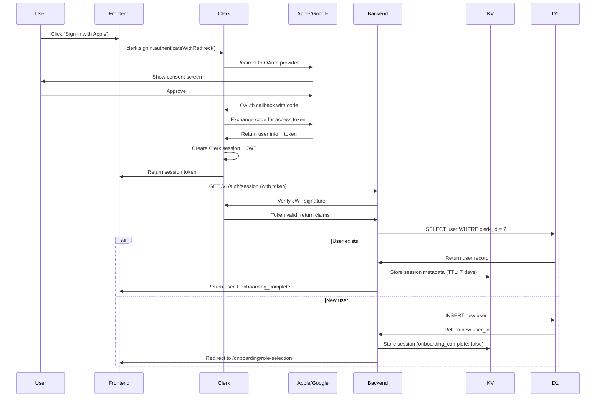
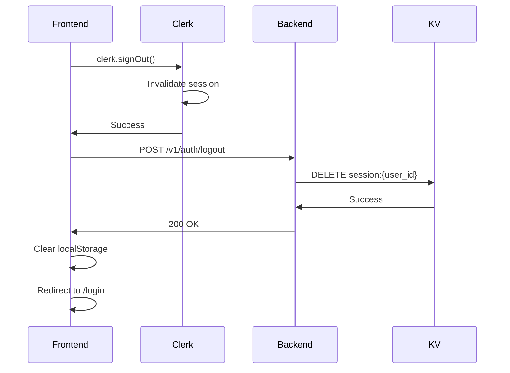

# Session Management - Umbrella MVP

**Version:** 1.0
**Last Updated:** 2025-11-15
**Status:** Ready for Development

---

## Overview

This document defines the session management architecture for Umbrella MVP, including session token format, storage mechanisms, lifecycle management, and security considerations.

### Key Design Decisions

- **Authentication Provider:** Clerk (manages Apple/Google OAuth)
- **Session Token:** Clerk JWT tokens (not custom JWT)
- **Token Lifetime:** 7 days (managed by Clerk)
- **Storage:** KV store for session metadata, Clerk manages token itself
- **Validation:** Per-request JWT validation via Clerk SDK
- **Onboarding Gate:** Sessions checked for `onboarding_complete` flag

---

## Session Token Format

### Clerk JWT Structure

Umbrella uses **Clerk-managed JWT tokens** for authentication. Tokens are issued by Clerk after successful OAuth authentication.

#### Token Header
```json
{
  "alg": "RS256",
  "typ": "JWT",
  "kid": "clerk_key_id"
}
```

#### Token Payload
```json
{
  "sub": "clerk_user_id",
  "iss": "https://clerk.umbrella.app",
  "aud": "umbrella-app",
  "exp": 1734192000,
  "iat": 1733587200,
  "nbf": 1733587200,
  "email": "artist@example.com",
  "email_verified": true,
  "name": "John Smith",
  "picture": "https://img.clerk.com/...",
  "azp": "umbrella-web-client"
}
```

#### Key Fields

| Field | Type | Description |
|-------|------|-------------|
| `sub` | string | Clerk user ID (unique identifier) |
| `iss` | string | Token issuer (Clerk instance URL) |
| `aud` | string | Audience (app identifier) |
| `exp` | number | Token expiration timestamp (Unix) |
| `iat` | number | Token issued at timestamp (Unix) |
| `email` | string | User's email from OAuth provider |
| `email_verified` | boolean | Email verification status |
| `name` | string | User's full name from OAuth provider |

---

## Session Storage

### KV Store Schema

While Clerk manages the JWT token, Umbrella stores **session metadata** in Cloudflare KV for fast lookup and additional session state.

#### Key Format
```
session:{user_id}
```

#### Value Structure
```json
{
  "user_id": "uuid_v4",
  "clerk_id": "clerk_user_id",
  "email": "artist@example.com",
  "oauth_provider": "apple" | "google",
  "oauth_id": "provider_user_id",
  "onboarding_complete": true,
  "created_at": "2025-11-15T12:00:00Z",
  "last_active_at": "2025-11-15T12:00:00Z",
  "expires_at": "2025-11-22T12:00:00Z"
}
```

#### Field Descriptions

| Field | Type | Description |
|-------|------|-------------|
| `user_id` | string | Internal Umbrella user UUID |
| `clerk_id` | string | Clerk user ID (from JWT `sub`) |
| `email` | string | User's email address |
| `oauth_provider` | string | OAuth provider: "apple" or "google" |
| `oauth_id` | string | Provider's user ID |
| `onboarding_complete` | boolean | Has user completed 5-step onboarding? |
| `created_at` | string | Session creation timestamp (ISO 8601) |
| `last_active_at` | string | Last API request timestamp |
| `expires_at` | string | Session expiration timestamp (7 days from creation) |

### TTL Configuration

| Storage | TTL | Rationale |
|---------|-----|-----------|
| KV session metadata | 7 days | Matches Clerk token lifetime |
| JWT token (Clerk-managed) | 7 days | Clerk default for web apps |
| Refresh token (Clerk-managed) | 30 days | Automatic refresh via Clerk SDK |

---

## Session Lifecycle

### 1. Session Creation (OAuth Sign-In)

**Flow:**


**Steps:**
1. User clicks OAuth button (Apple/Google)
2. Clerk SDK initiates OAuth flow
3. OAuth provider authenticates user
4. Clerk creates session and issues JWT token
5. Frontend receives token, stores in localStorage
6. Frontend calls `GET /v1/auth/session` with token
7. Backend validates JWT via Clerk SDK
8. Backend checks if user exists in D1:
   - If exists: Return user data
   - If new: Create user record with `onboarding_complete = false`
9. Backend stores session metadata in KV (TTL: 7 days)
10. Frontend checks `onboarding_complete`:
    - `true`: Navigate to dashboard
    - `false`: Navigate to onboarding Step 1

### 2. Session Validation (Per-Request)

**Middleware Flow:**
```typescript
// api/middleware/auth.ts
export async function authenticateRequest(request: Request, env: Env): Promise<Session> {
  // 1. Extract token from Authorization header
  const authHeader = request.headers.get('Authorization')
  if (!authHeader || !authHeader.startsWith('Bearer ')) {
    throw new Error('Missing or invalid Authorization header')
  }

  const token = authHeader.substring(7) // Remove "Bearer "

  // 2. Verify JWT via Clerk
  const clerkClient = createClerkClient({ secretKey: env.CLERK_SECRET_KEY })
  let clerkUser
  try {
    clerkUser = await clerkClient.verifyToken(token)
  } catch (error) {
    throw new Error('Invalid or expired token')
  }

  const clerkId = clerkUser.sub

  // 3. Check KV cache for session metadata
  const cacheKey = `session:${clerkId}`
  const cachedSession = await env.KV.get(cacheKey, 'json')

  if (cachedSession && cachedSession.expires_at > new Date().toISOString()) {
    // Update last active timestamp
    cachedSession.last_active_at = new Date().toISOString()
    await env.KV.put(cacheKey, JSON.stringify(cachedSession), {
      expirationTtl: 7 * 24 * 60 * 60 // 7 days
    })
    return cachedSession
  }

  // 4. Cache miss or expired - fetch from D1
  const user = await env.DB.prepare(
    'SELECT * FROM users WHERE clerk_id = ?'
  ).bind(clerkId).first()

  if (!user) {
    throw new Error('User not found')
  }

  // 5. Build session object
  const session = {
    user_id: user.id,
    clerk_id: clerkId,
    email: user.email,
    oauth_provider: user.oauth_provider,
    oauth_id: user.oauth_id,
    onboarding_complete: user.onboarding_complete === 1,
    created_at: user.created_at,
    last_active_at: new Date().toISOString(),
    expires_at: new Date(Date.now() + 7 * 24 * 60 * 60 * 1000).toISOString()
  }

  // 6. Cache in KV
  await env.KV.put(cacheKey, JSON.stringify(session), {
    expirationTtl: 7 * 24 * 60 * 60
  })

  return session
}
```

**Performance Optimization:**
- **KV Cache First:** Check KV before hitting D1 (sub-50ms latency)
- **Cache Duration:** 7 days TTL (matches token lifetime)
- **Last Active Update:** Update timestamp on each request (for analytics)

### 3. Onboarding Gate

**Middleware to enforce onboarding completion:**
```typescript
export async function checkOnboardingComplete(session: Session): Promise<boolean> {
  if (!session.onboarding_complete) {
    throw new OnboardingIncompleteError('User must complete onboarding')
  }
  return true
}
```

**Protected Endpoints:**
All endpoints **except** the following require `onboarding_complete = true`:
- `POST /v1/auth/webhook`
- `GET /v1/auth/session`
- `POST /v1/auth/logout`
- `POST /v1/onboarding/artists/*` (onboarding endpoints)

**Behavior:**
- If `onboarding_complete = false`: Return `403 FORBIDDEN` with message "Complete onboarding to access this feature"
- Frontend redirects to `/onboarding/artists/step1` (D-006)

### 4. Session Refresh

**Automatic Refresh via Clerk SDK:**
- Clerk SDK automatically refreshes tokens before expiration
- No manual refresh needed in backend API
- Frontend Clerk SDK handles refresh transparently

**Manual Session Refresh Endpoint:**
```http
POST /v1/auth/refresh
Authorization: Bearer <token>
```

**Response:**
```json
{
  "data": {
    "token": "new_jwt_token",
    "expires_at": "2025-11-22T12:00:00Z"
  }
}
```

**Use Case:** Useful for extending session when user actively using app

### 5. Session Termination (Logout)

**Flow:**


**Steps:**
1. User clicks "Logout"
2. Frontend calls `clerk.signOut()` (invalidates Clerk session)
3. Frontend calls `POST /v1/auth/logout`
4. Backend deletes session metadata from KV
5. Frontend clears localStorage
6. Frontend redirects to login page

**Endpoint:**
```http
POST /v1/auth/logout
Authorization: Bearer <token>
```

**Note:** Endpoint is **idempotent** (always returns success, even if session doesn't exist)

### 6. Session Expiration

**Automatic Expiration:**
- **JWT Token:** Expires after 7 days (Clerk-managed)
- **KV Session:** TTL of 7 days (auto-deleted)
- **Refresh Token:** 30 days (Clerk-managed, auto-refresh)

**Expired Session Behavior:**
- Backend returns `401 UNAUTHORIZED`
- Frontend detects 401, calls `clerk.signOut()`
- Frontend redirects to login page
- User must re-authenticate via OAuth

---

## Security Considerations

### JWT Signature Verification

**Algorithm:** RS256 (RSA signature with SHA-256)

**Verification Process:**
1. Extract token from `Authorization: Bearer <token>` header
2. Decode token header to get `kid` (key ID)
3. Fetch Clerk's public keys from `https://<clerk-instance>/.well-known/jwks.json`
4. Find matching public key by `kid`
5. Verify signature using public key
6. Validate `exp` (expiration), `iss` (issuer), `aud` (audience)
7. If valid: Extract user claims
8. If invalid: Throw `401 UNAUTHORIZED`

**Caching Public Keys:**
```typescript
// Cache Clerk public keys for 1 hour
const jwksCache = {
  keys: null,
  expiresAt: 0
}

async function getClerkPublicKeys(env: Env): Promise<JWK[]> {
  const now = Date.now()
  if (jwksCache.keys && now < jwksCache.expiresAt) {
    return jwksCache.keys
  }

  const response = await fetch(`${env.CLERK_FRONTEND_API}/.well-known/jwks.json`)
  const jwks = await response.json()

  jwksCache.keys = jwks.keys
  jwksCache.expiresAt = now + 3600 * 1000 // 1 hour

  return jwks.keys
}
```

### Token Storage

**Frontend Storage:**
- **Primary:** Browser `localStorage` (persistent across sessions)
- **Fallback:** `sessionStorage` (cleared on tab close)
- **Cookie:** `__clerk_session` (HttpOnly, Secure, SameSite)

**Security Best Practices:**
- ✅ Use HTTPS only (tokens never sent over HTTP)
- ✅ HttpOnly cookies prevent XSS access
- ✅ SameSite=Strict prevents CSRF
- ✅ Tokens include `exp` claim (expiration)
- ✅ Backend validates every request

### Session Hijacking Prevention

**Measures:**
1. **Short-lived tokens:** 7-day expiration (re-auth required after)
2. **HTTPS only:** Tokens never transmitted over insecure connections
3. **No token in URL:** Always in header or HttpOnly cookie
4. **IP tracking (optional):** Track session IP, alert on change
5. **Device fingerprinting (future):** Detect suspicious device changes

### Refresh Token Rotation

**Clerk Automatic Rotation:**
- Clerk automatically rotates refresh tokens on use
- Old refresh tokens invalidated after single use
- Prevents token reuse attacks

---

## Session Analytics

### Tracking Metrics

Session metadata stored in KV enables analytics:

**Metrics Tracked:**
- `created_at`: Session start time
- `last_active_at`: Most recent API request
- `expires_at`: Session expiration time

**Analytics Queries:**
```sql
-- Daily active users (from session activity)
SELECT COUNT(DISTINCT user_id) AS dau
FROM kv_session_logs
WHERE last_active_at >= DATE('now', '-1 day')

-- Average session duration
SELECT AVG(JULIANDAY(expires_at) - JULIANDAY(created_at)) * 24 AS avg_hours
FROM kv_session_logs
WHERE expires_at IS NOT NULL
```

**Future Enhancement:** Log session activity to D1 for historical analytics

---

## Error Handling

### Common Session Errors

| Error | HTTP Status | Code | Description |
|-------|------------|------|-------------|
| Missing token | 401 | `UNAUTHORIZED` | No Authorization header |
| Invalid token | 401 | `UNAUTHORIZED` | JWT signature verification failed |
| Expired token | 401 | `UNAUTHORIZED` | Token `exp` claim in past |
| User not found | 404 | `NOT_FOUND` | User deleted or doesn't exist |
| Onboarding incomplete | 403 | `FORBIDDEN` | User must complete onboarding |

### Error Response Format

```json
{
  "error": {
    "code": "UNAUTHORIZED",
    "message": "Invalid or expired token",
    "details": {
      "reason": "JWT signature verification failed"
    }
  },
  "meta": {
    "timestamp": "2025-11-15T12:00:00Z"
  }
}
```

---

## Implementation Checklist

### Backend (Cloudflare Workers)

- [ ] Install Clerk SDK: `npm install @clerk/backend`
- [ ] Add Clerk environment variables to `wrangler.toml`
  - `CLERK_SECRET_KEY`
  - `CLERK_FRONTEND_API`
- [ ] Implement `authenticateRequest()` middleware
- [ ] Implement `checkOnboardingComplete()` middleware
- [ ] Create session KV namespace: `umbrella-sessions`
- [ ] Implement `POST /v1/auth/webhook` for Clerk events
- [ ] Implement `GET /v1/auth/session` endpoint
- [ ] Implement `POST /v1/auth/logout` endpoint
- [ ] Implement `POST /v1/auth/refresh` endpoint
- [ ] Add session validation to all protected endpoints

### Frontend (React + Clerk SDK)

- [ ] Install Clerk SDK: `npm install @clerk/clerk-react`
- [ ] Configure Clerk provider in App.tsx
- [ ] Add OAuth buttons (Apple, Google)
- [ ] Implement sign-in redirect flow
- [ ] Store session token in localStorage
- [ ] Add token to all API requests (Authorization header)
- [ ] Handle 401 errors (redirect to login)
- [ ] Handle 403 errors (redirect to onboarding)
- [ ] Implement logout flow
- [ ] Auto-refresh tokens via Clerk SDK

### Database (D1)

- [ ] Ensure `users` table has `clerk_id` column
- [ ] Add index on `clerk_id` for fast lookups
- [ ] Add `onboarding_complete` boolean column
- [ ] Migrate existing users (if any)

### Testing

- [ ] Test OAuth flow (Apple + Google)
- [ ] Test JWT validation (valid, invalid, expired tokens)
- [ ] Test session creation in KV
- [ ] Test session cache hit/miss
- [ ] Test onboarding gate (redirect when incomplete)
- [ ] Test logout (KV deletion)
- [ ] Test concurrent sessions (same user, multiple devices)
- [ ] Load test session validation (5000 req/sec)

---

## Environment Configuration

### Required Environment Variables

**Backend (Cloudflare Workers):**
```toml
[env.production]
CLERK_SECRET_KEY = "sk_live_..."
CLERK_FRONTEND_API = "https://clerk.umbrella.app"
CLERK_WEBHOOK_SECRET = "whsec_..."

[env.staging]
CLERK_SECRET_KEY = "sk_test_..."
CLERK_FRONTEND_API = "https://clerk-staging.umbrella.app"
CLERK_WEBHOOK_SECRET = "whsec_..."
```

**Frontend (React):**
```env
VITE_CLERK_PUBLISHABLE_KEY=pk_live_...
VITE_API_BASE_URL=https://api.umbrella.app
```

### KV Namespace

**Production:**
```bash
wrangler kv:namespace create "SESSIONS"
# Returns: { binding = "SESSIONS", id = "..." }
```

**Add to wrangler.toml:**
```toml
[[kv_namespaces]]
binding = "SESSIONS"
id = "production_sessions_namespace_id"

[[env.staging.kv_namespaces]]
binding = "SESSIONS"
id = "staging_sessions_namespace_id"
```

---

## Monitoring & Alerts

### Session Metrics to Track

1. **Session Creation Rate**
   - Alert if < 10 sessions/hour (sign-in broken?)
   - Alert if > 1000 sessions/hour (attack?)

2. **Token Validation Failures**
   - Alert if error rate > 5% for 5 minutes
   - Indicates Clerk outage or token issues

3. **KV Cache Hit Rate**
   - Target: >95% hit rate
   - Alert if < 90% (performance degradation)

4. **Average Session Duration**
   - Baseline: ~2-3 days (users logging in every few days)
   - Alert if drops below 1 day (users logging out frequently)

### Logging

**Structured Logs:**
```json
{
  "level": "info",
  "event": "session_created",
  "user_id": "uuid_v4",
  "clerk_id": "clerk_user_id",
  "oauth_provider": "apple",
  "timestamp": "2025-11-15T12:00:00Z"
}
```

**Events to Log:**
- `session_created`: New session after OAuth
- `session_validated`: Successful token validation
- `session_expired`: Token expiration
- `session_terminated`: User logout
- `token_invalid`: JWT validation failure
- `onboarding_incomplete`: User blocked by onboarding gate

---

## FAQ

### Q: Why use Clerk instead of custom JWT?

**A:** Clerk provides:
- Managed OAuth flows (Apple, Google)
- Automatic token refresh
- Webhook infrastructure for user events
- Built-in session management
- Lower development cost (no custom OAuth implementation)

### Q: What happens if KV is down?

**A:** Session validation falls back to D1:
1. Attempt KV lookup
2. If KV unavailable, query D1 directly
3. Continue processing request (degraded performance but functional)
4. Alert ops team if KV down > 5 minutes

### Q: Can users have multiple concurrent sessions?

**A:** Yes, users can:
- Log in on desktop and mobile simultaneously
- Each device has independent Clerk session
- KV stores single session metadata per user (last active device overwrites)
- **Future enhancement:** Store session per device (`session:{user_id}:{device_id}`)

### Q: How do we handle session replay attacks?

**A:** Protection mechanisms:
- **JWT nonce:** Each token has unique `jti` claim
- **Short expiration:** 7-day max lifetime
- **Refresh rotation:** Clerk rotates refresh tokens on use
- **HTTPS only:** Tokens never sent over insecure connections

### Q: What if a user's email changes in OAuth provider?

**A:** Clerk webhook flow:
1. User changes email in Apple/Google account
2. OAuth provider notifies Clerk
3. Clerk triggers `user.updated` webhook
4. Backend receives webhook, updates `users.email` in D1
5. Session metadata in KV updated on next request

---

## Appendix A: Session Data Model

### Database Schema

```sql
-- users table (D1)
CREATE TABLE users (
  id TEXT PRIMARY KEY,
  clerk_id TEXT NOT NULL UNIQUE,
  oauth_provider TEXT NOT NULL CHECK(oauth_provider IN ('apple', 'google')),
  oauth_id TEXT NOT NULL,
  email TEXT NOT NULL,
  onboarding_complete INTEGER NOT NULL DEFAULT 0,
  created_at TEXT NOT NULL,
  updated_at TEXT NOT NULL,
  UNIQUE(oauth_provider, oauth_id)
);

-- Index for session validation
CREATE INDEX idx_users_clerk_id ON users(clerk_id);
```

### KV Schema

**Key:** `session:{clerk_id}`

**Value:** JSON object (see "KV Store Schema" section above)

**TTL:** 7 days (604800 seconds)

---

## Appendix B: Clerk Webhook Payload Examples

### user.created

```json
{
  "data": {
    "id": "user_2abc...",
    "email_addresses": [
      {
        "email_address": "artist@example.com",
        "verification": { "status": "verified" }
      }
    ],
    "external_accounts": [
      {
        "provider": "oauth_apple",
        "email_address": "artist@example.com",
        "approved_scopes": "email name",
        "label": null,
        "id": "eac_2abc..."
      }
    ],
    "first_name": "John",
    "last_name": "Smith",
    "profile_image_url": "https://img.clerk.com/...",
    "created_at": 1733587200000,
    "updated_at": 1733587200000
  },
  "event_attributes": { ... },
  "object": "event",
  "type": "user.created"
}
```

### user.updated

```json
{
  "data": {
    "id": "user_2abc...",
    "email_addresses": [
      {
        "email_address": "newemail@example.com",
        "verification": { "status": "verified" }
      }
    ],
    "updated_at": 1733673600000
  },
  "object": "event",
  "type": "user.updated"
}
```

### user.deleted

```json
{
  "data": {
    "id": "user_2abc...",
    "deleted": true
  },
  "object": "event",
  "type": "user.deleted"
}
```

---

## Version History

| Version | Date | Changes |
|---------|------|---------|
| 1.0 | 2025-11-15 | Initial session management documentation |

---

**Document Status:** ✅ Ready for Development

**Related Documents:**
- `docs/API_CONTRACT.md` - API endpoint specifications
- `docs/database-schema.md` - Database schema and models
- `docs/AUTH.md` - Authentication flow details

**Next Steps:**
1. Configure Clerk application
2. Implement backend session middleware
3. Integrate Clerk SDK in frontend
4. Test OAuth flows (Apple + Google)
5. Set up session monitoring

**Questions or Issues:** Contact technical lead or create issue in project repo.
